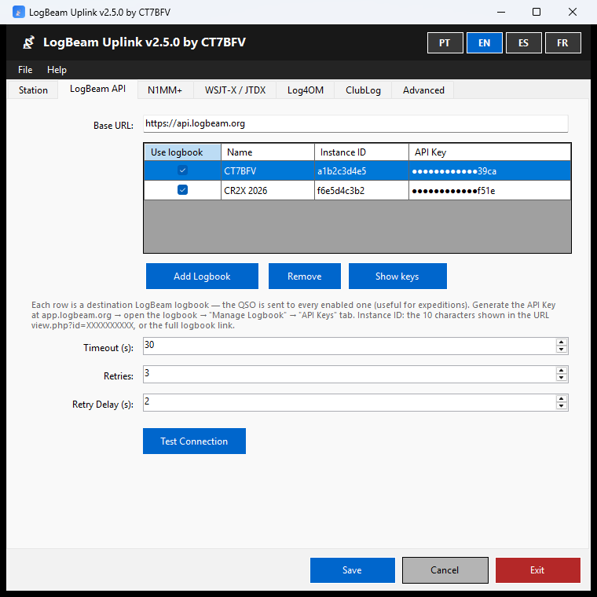
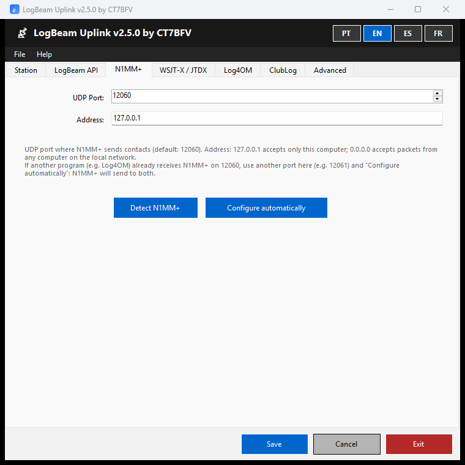
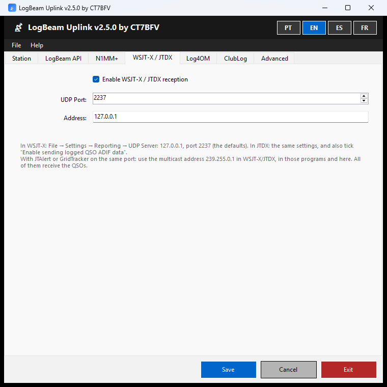
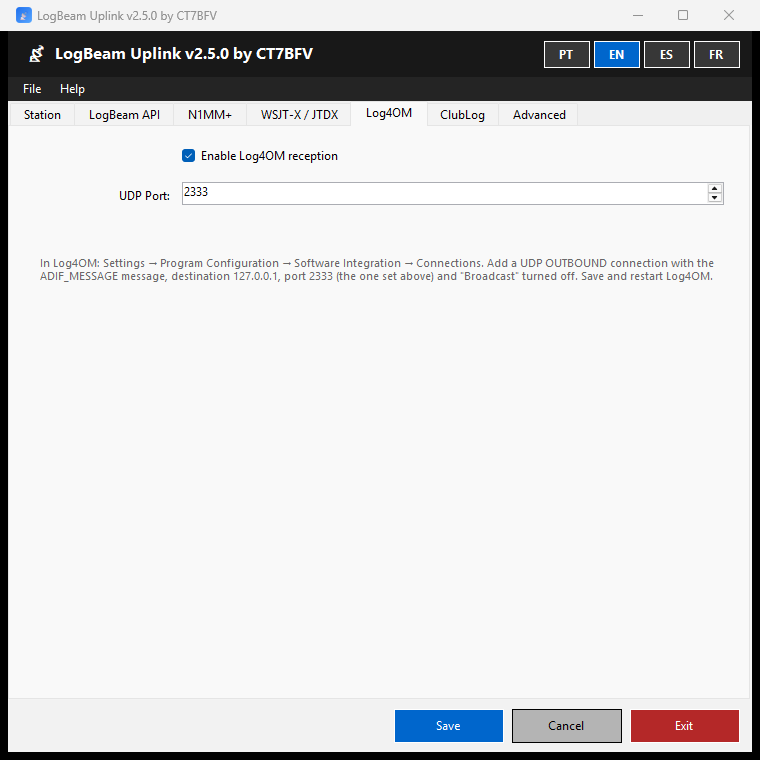
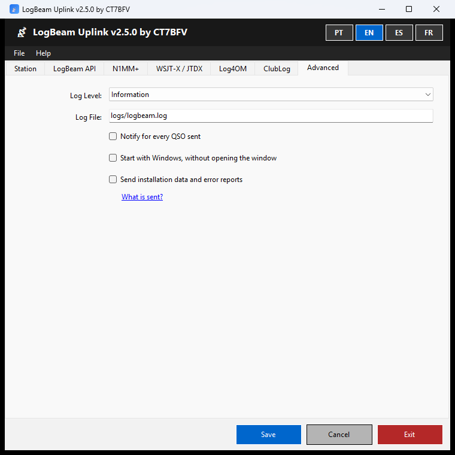
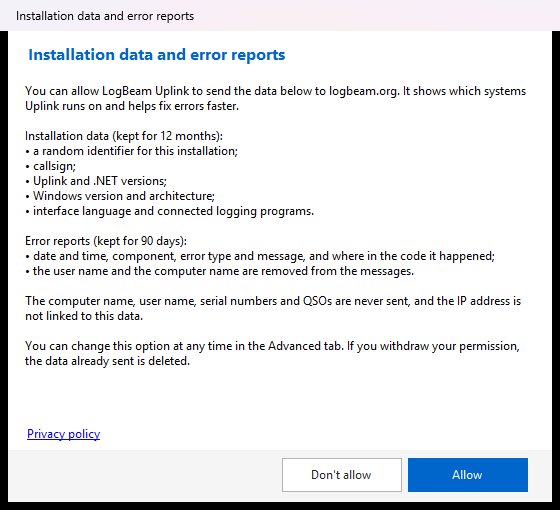

<p align="center"></p>

<h1 align="center">LogBeam Uplink</h1>

<p align="center"><b>Every QSO from N1MM+, WSJT-X, JTDX and Log4OM in your LogBeam logbook, as soon as it is logged.</b></p>

<p align="center">
  <a href="https://logbeam.org/uplink/"></a>
  
  <a href="https://www.gnu.org/licenses/gpl-3.0.html"></a>
</p>

<p align="center"><a href="README.md">Português</a> · <b>English</b> · <a href="README.es.md">Español</a> · <a href="README.fr.md">Français</a></p>

---

LogBeam Uplink is a Windows application that receives each QSO as soon as it is logged in your logging program and sends it to your logbook on [LogBeam](https://logbeam.org) and, if you turn it on, to ClubLog. The LogBeam 3D globe updates by itself, with no ADIF export or import.

<p align="center"><a href="https://logbeam.org"></a></p>

**Contents:** [Features](#features) · [Screenshots](#screenshots) · [Download and install](#download-and-install) · [Getting started](#getting-started) · [Manual](#manual) · [Limitations](#limitations-of-version-25) · [Privacy](#privacy) · [Building](#building) · [Contributing](#contributing-and-security) · [Licence](#licence)

## Features

### Logging programs

| Program | How it connects to Uplink | Manual |
|---|---|---|
| **N1MM+** | One-click automatic configuration. A backup copy of the N1MM+ configuration is made, and any destinations already there are kept | [N1MM+](docs/MANUAL.en.md#n1mm) |
| **WSJT-X** and **JTDX** | Through the program's own UDP Server (port 2237). Shares the port with JTAlert and GridTracker through multicast | [WSJT-X / JTDX](docs/MANUAL.en.md#wsjt-x--jtdx) |
| **Log4OM** | Through a UDP OUTBOUND connection with the ADIF_MESSAGE message (port 2333) | [Log4OM](docs/MANUAL.en.md#log4om) |

### Destinations

| Feature | Description | Manual |
|---|---|---|
| Several LogBeam logbooks | Each QSO is sent to every active logbook, for example an expedition's logbook and your own. Each logbook is turned on or off with one click in the icon menu | [LogBeam API](docs/MANUAL.en.md#logbeam-api) |
| Test Connection | Checks the API key and shows whose logbook it is | [LogBeam API](docs/MANUAL.en.md#logbeam-api) |
| Real-time ClubLog | Upload with a ClubLog Application Password. If ClubLog rejects the credentials, Uplink warns you and stops uploading until they are fixed, so that the IP address is not blocked; QSOs stay in the queue | [ClubLog](docs/MANUAL.en.md#clublog) |

### Reliability

| Feature | Description | Manual |
|---|---|---|
| Offline queue | QSOs that cannot be sent are queued, and the queue survives restarting Uplink and Windows. Retried every minute, in order of arrival | [Without internet](docs/MANUAL.en.md#5-without-internet) |
| Duplicates | The server detects repeated QSOs to the minute and Uplink tells you the QSO was already there | [Notifications](docs/MANUAL.en.md#3-the-window-and-the-notification-area) |
| Port in use | Notification when another program is using a logging program's port | [Troubleshooting](docs/MANUAL.en.md#8-troubleshooting) |
| Export the session | Saves to an ADIF file the QSOs sent since the service started | [Exporting the session](docs/MANUAL.en.md#6-exporting-the-session) |
| Daily logs | One log file per day, kept for 30 days, with an adjustable level of detail | [Advanced](docs/MANUAL.en.md#advanced) |

### Day to day

| Feature | Description | Manual |
|---|---|---|
| Notification area | Closing the window does not end the program. The icon menu turns the service and each logbook on or off | [The window and the notification area](docs/MANUAL.en.md#3-the-window-and-the-notification-area) |
| Notifications | Send failures, QSOs sent (optional), duplicates, ports in use and rejected ClubLog credentials | [The window and the notification area](docs/MANUAL.en.md#3-the-window-and-the-notification-area) |
| ✓ Confirmed by another LogBeam | Notification when the other station also has the QSO in a LogBeam logbook | [The window and the notification area](docs/MANUAL.en.md#3-the-window-and-the-notification-area) |
| Start with Windows | Uplink starts with Windows, without opening the window | [Advanced](docs/MANUAL.en.md#advanced) |
| Single instance | Starting Uplink again brings the window that is already open to the front | [The window and the notification area](docs/MANUAL.en.md#3-the-window-and-the-notification-area) |
| Updates | Uplink checks at start-up whether a new version is available and tells you | [Updates](docs/MANUAL.en.md#7-updates) |
| Four languages | Interface in Portuguese, English, Spanish and French, chosen with the buttons at the top of the window | [The window and the notification area](docs/MANUAL.en.md#3-the-window-and-the-notification-area) |

### Security and privacy

| Feature | Description | Manual |
|---|---|---|
| Encrypted keys | API keys and passwords are encrypted, readable only by the Windows user who saved them. They are masked in the grid | [Troubleshooting](docs/MANUAL.en.md#8-troubleshooting) |
| This computer only | By default, Uplink only accepts packets from this computer. Receiving from the local network has to be requested | [N1MM+](docs/MANUAL.en.md#n1mm) |
| Data only with permission | Installation data and error reports are only sent with permission, and are deleted from the server when it is withdrawn | [First start](docs/MANUAL.en.md#2-first-start) |
| Simple installation | No administrator rights and no .NET to install | [Installing](docs/MANUAL.en.md#1-installing) |

## Screenshots

<table>
  <tr>
    <td align="center"><a href="docs/images/en-api.png"></a><br><sub>Destination logbooks</sub></td>
    <td align="center"><a href="docs/images/en-n1mm.png"></a><br><sub>N1MM+</sub></td>
  </tr>
  <tr>
    <td align="center"><a href="docs/images/en-wsjtx.png"></a><br><sub>WSJT-X / JTDX</sub></td>
    <td align="center"><a href="docs/images/en-log4om.png"></a><br><sub>Log4OM</sub></td>
  </tr>
  <tr>
    <td align="center"><a href="docs/images/en-avancado.png"></a><br><sub>Advanced</sub></td>
    <td align="center"><a href="docs/images/en-consentimento.png"></a><br><sub>Permission request at first start</sub></td>
  </tr>
</table>

## Download and install

The official release is at **https://logbeam.org/uplink/**, with the SHA-256 fingerprint of the installer.

- **Requirements:** Windows 10 or 11, 64-bit.
- **Installation:** no administrator rights, and .NET is not needed.
- **Checking the installer:** in PowerShell, `Get-FileHash .\LogBeamUplink-Setup-X.Y.Z.exe`. The result must match the SHA-256 published on the page.

> ⚠️ The program is free and open source, and is distributed **without a digital signature**:
> - **SmartScreen:** Windows may show "Windows protected your PC". To continue: "More info" → "Run anyway".
> - **Smart App Control (Windows 11):** may block the installer with no option to continue. In that case it has to be turned off in Windows Security → App & browser control → Smart App Control.

## Getting started

1. On [LogBeam](https://app.logbeam.org), open your logbook → "Manage Logbook" → "API Keys" tab and generate a key.
2. In Uplink, **LogBeam API** tab → "Add Logbook": paste the logbook link (or the Instance ID) and the API key → "Test Connection" → "Save".
3. Connect your logging program to Uplink:
   - **N1MM+:** N1MM+ tab → "Configure automatically", with N1MM+ closed.
   - **WSJT-X / JTDX:** File → Settings → Reporting → UDP Server 127.0.0.1, port 2237. In JTDX, also tick "Enable sending logged QSO ADIF data".
   - **Log4OM:** a UDP OUTBOUND connection with the ADIF_MESSAGE message, destination 127.0.0.1, port 2333 and "Broadcast" turned off.

> 💡 If JTAlert or GridTracker use the WSJT-X port, see [sharing the port through multicast](docs/MANUAL.en.md#wsjt-x--jtdx).

## Manual

The manual covers each tab, the notifications, the offline queue and troubleshooting.

| Language | Manual |
|---|---|
| Português | [docs/MANUAL.pt.md](docs/MANUAL.pt.md) |
| English | [docs/MANUAL.en.md](docs/MANUAL.en.md) |
| Español | [docs/MANUAL.es.md](docs/MANUAL.es.md) |
| Français | [docs/MANUAL.fr.md](docs/MANUAL.fr.md) |

## Limitations of version 2.5

- A QSO edited or deleted in the logging program after it was sent stays in LogBeam and ClubLog as it was sent. Propagating edits and deletions is planned for version 2.6.
- Windows only.

## Privacy

Installation data and error reports are only sent with the operator's permission, asked at first start and changeable in the "Advanced" tab. QSOs, the computer name and the user name are never sent. See the [privacy policy](https://logbeam.org/#privacy).

## Building

<details>
<summary>How to build Uplink and the installer</summary>

<br>

Requirements: Windows 10 or later and the [.NET 8 SDK](https://dotnet.microsoft.com/download/dotnet/8.0) (x64).

```
dotnet build LogBeam.sln -c Release
dotnet test LogBeam.sln -c Release
```

Installer ([Inno Setup 6](https://jrsoftware.org/isinfo.php)): publish the executable first, then compile `LogBeam.iss`, which reads the version from the published executable:

```
dotnet publish src/LogBeam.UI/LogBeam.UI.csproj -c Release -r win-x64 --self-contained true -p:PublishSingleFile=true -p:IncludeNativeLibrariesForSelfExtract=true -o publish
ISCC.exe LogBeam.iss
```

The version lives in a single place, `Directory.Build.props`. Official releases are built by `.github/workflows/release.yml` when a `vX.Y.Z` tag is created.

**ClubLog:** uploading to ClubLog requires a ClubLog application key, which is not in the repository. Without it the application builds and works, but ClubLog upload is disabled. To include one in your own build, set the `CLUBLOG_API_KEY` environment variable or create a `clublog.key` file at the repository root (not versioned). The key must be requested from ClubLog by whoever distributes the application.

</details>

## Contributing and security

- Contributions: see [CONTRIBUTING.md](CONTRIBUTING.md).
- Security issues: report them privately, as described in [SECURITY.md](SECURITY.md).

## Licence

LogBeam Uplink is free software, distributed under the [GNU General Public License v3.0](https://www.gnu.org/licenses/gpl-3.0.html). The full text is in the [LICENSE](LICENSE) file.

## Disclaimer

- The software is distributed without any warranty.
- Modified versions are the responsibility of whoever modifies and distributes them; the author is not liable for them.
- Official releases are only those published at https://logbeam.org/uplink/, with the SHA-256 shown on that page.
- The LogBeam name and icon identify the official release; modified versions must use a different name (GPL v3, section 7, paragraph e).

---

<p align="center">© 2026 Octávio Filipe Pereira Gonçalves (CT7BFV) · <a href="https://logbeam.org">logbeam.org</a></p>
