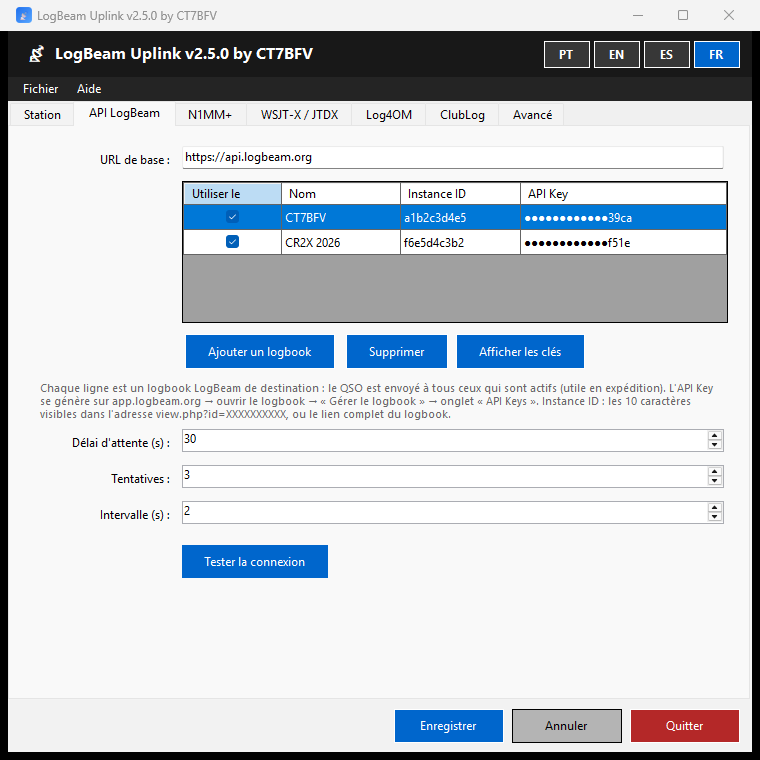
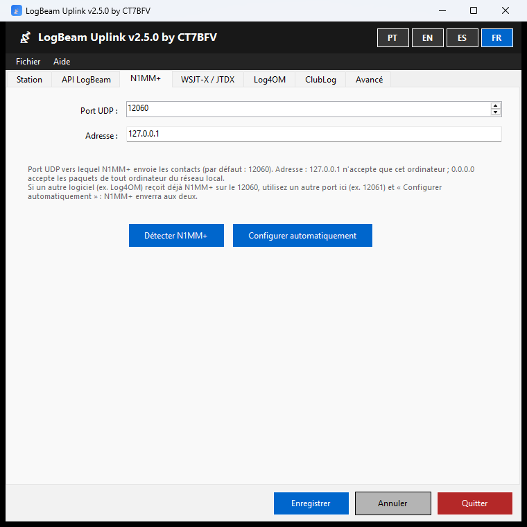
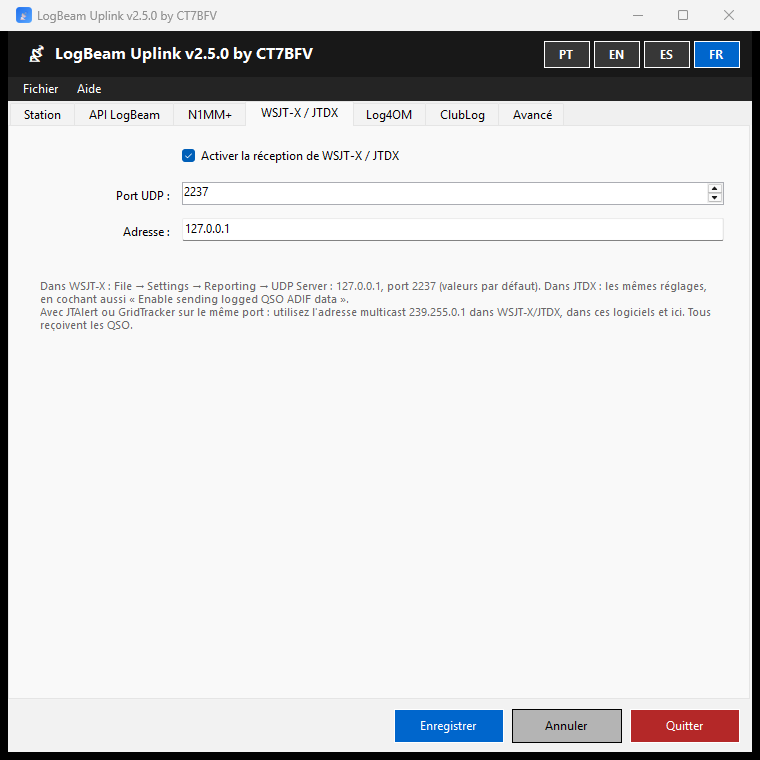
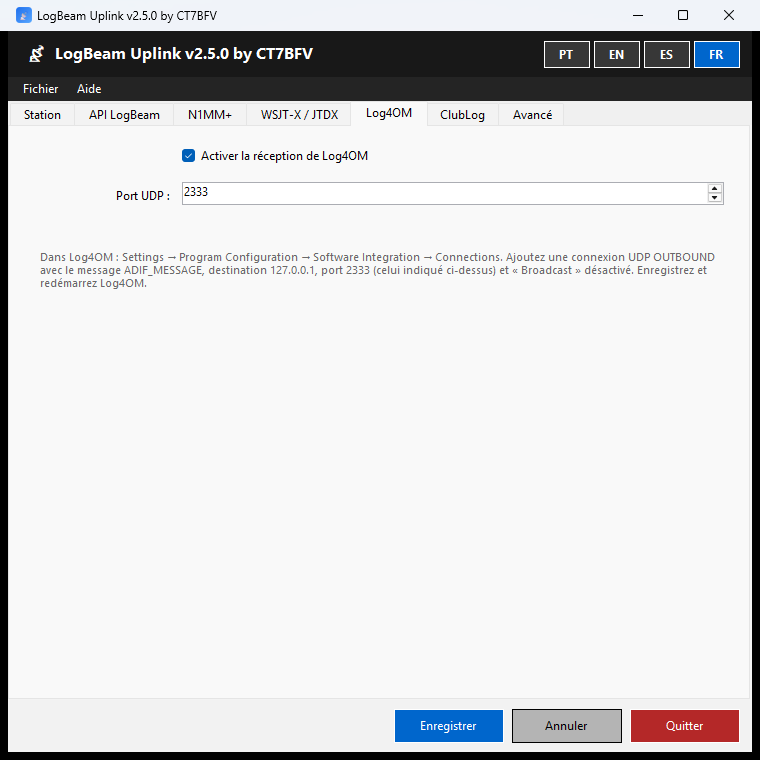
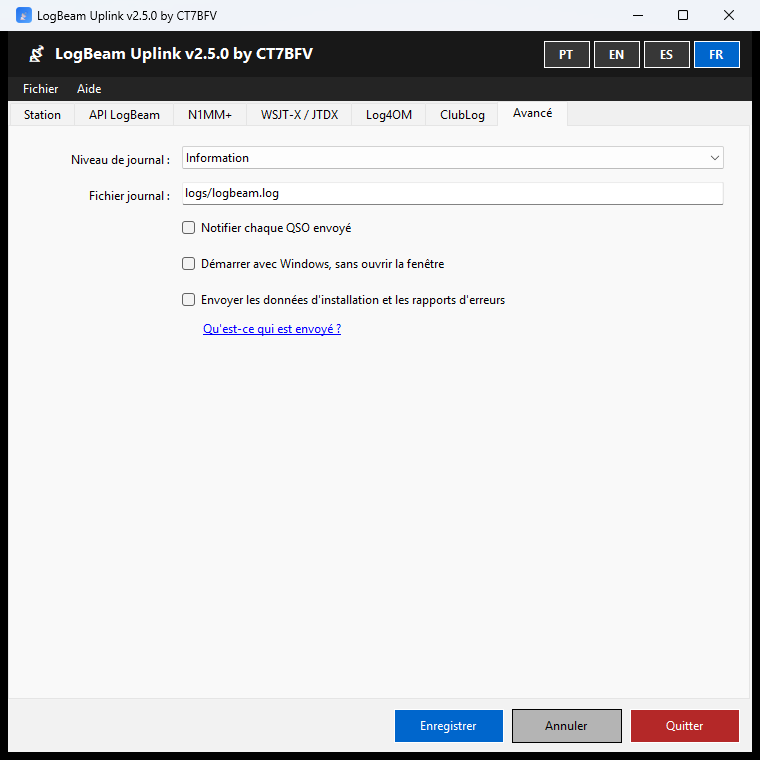
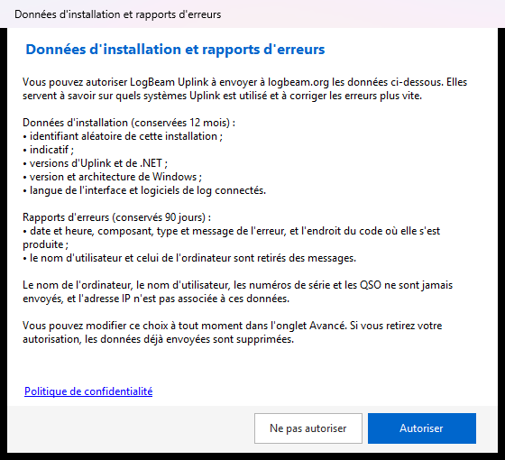

<p align="center"></p>

<h1 align="center">LogBeam Uplink</h1>

<p align="center"><b>Chaque QSO de N1MM+, WSJT-X, JTDX et Log4OM dans votre logbook LogBeam, dès qu'il est enregistré.</b></p>

<p align="center">
  <a href="https://logbeam.org/uplink/"></a>
  
  <a href="https://www.gnu.org/licenses/gpl-3.0.html"></a>
</p>

<p align="center"><a href="README.md">Português</a> · <a href="README.en.md">English</a> · <a href="README.es.md">Español</a> · <b>Français</b></p>

---

LogBeam Uplink est une application pour Windows qui reçoit chaque QSO dès qu'il est enregistré dans le logiciel de log et l'envoie vers votre logbook sur [LogBeam](https://logbeam.org) et, si vous l'activez, vers ClubLog. Le globe 3D de LogBeam se met à jour tout seul, sans exporter ni importer de fichiers ADIF.

<p align="center"><a href="https://logbeam.org"></a></p>

**Sommaire :** [Fonctionnalités](#fonctionnalités) · [Captures d'écran](#captures-décran) · [Télécharger et installer](#télécharger-et-installer) · [Premiers pas](#premiers-pas) · [Manuel](#manuel) · [Limites](#limites-de-la-version-250) · [Confidentialité](#confidentialité) · [Compiler](#compiler) · [Contribuer](#contribuer-et-sécurité) · [Licence](#licence)

## Fonctionnalités

### Logiciels de log

| Logiciel | Comment il se connecte à Uplink | Manuel |
|---|---|---|
| **N1MM+** | Configuration automatique en un clic. Une copie de sauvegarde de la configuration de N1MM+ est faite et les destinations déjà présentes sont conservées | [N1MM+](docs/MANUAL.fr.md#n1mm) |
| **WSJT-X** et **JTDX** | Par l'UDP Server du logiciel lui-même (port 2237). Partage le port avec JTAlert et GridTracker grâce au multicast | [WSJT-X / JTDX](docs/MANUAL.fr.md#wsjt-x--jtdx) |
| **Log4OM** | Par une connexion UDP OUTBOUND avec le message ADIF_MESSAGE (port 2333) | [Log4OM](docs/MANUAL.fr.md#log4om) |

### Destinations

| Fonctionnalité | Description | Manuel |
|---|---|---|
| Plusieurs logbooks LogBeam | Chaque QSO est envoyé à tous les logbooks actifs, par exemple celui d'une expédition et le vôtre. Chaque logbook s'active ou se désactive d'un clic dans le menu de l'icône | [API LogBeam](docs/MANUAL.fr.md#api-logbeam) |
| Tester la connexion | Vérifie l'API Key et indique à qui appartient le logbook | [API LogBeam](docs/MANUAL.fr.md#api-logbeam) |
| ClubLog en temps réel | Envoi avec un Application Password de ClubLog. Si ClubLog refuse les identifiants, Uplink prévient et arrête l'envoi jusqu'à leur correction, pour que l'adresse IP ne soit pas bloquée ; les QSO restent en file d'attente | [ClubLog](docs/MANUAL.fr.md#clublog) |

### Fiabilité

| Fonctionnalité | Description | Manuel |
|---|---|---|
| File d'attente hors ligne | Les QSO qui ne peuvent pas être envoyés sont mis en file d'attente, conservée au redémarrage d'Uplink et de Windows. Nouvel essai chaque minute, dans l'ordre d'arrivée | [Sans internet](docs/MANUAL.fr.md#5-sans-internet) |
| Doublons | Le serveur détecte les QSO répétés à la minute près et Uplink signale que le QSO existait déjà | [Notifications](docs/MANUAL.fr.md#3-la-fenêtre-et-la-zone-de-notification) |
| Port occupé | Notification quand un autre logiciel occupe le port d'un logiciel de log | [Dépannage](docs/MANUAL.fr.md#8-dépannage) |
| Exporter la session | Enregistre dans un fichier ADIF les QSO envoyés depuis le démarrage du service | [Exporter la session](docs/MANUAL.fr.md#6-exporter-la-session) |
| Journaux quotidiens | Un fichier journal par jour, conservé 30 jours, avec un niveau de détail réglable | [Avancé](docs/MANUAL.fr.md#avancé) |

### Au quotidien

| Fonctionnalité | Description | Manuel |
|---|---|---|
| Zone de notification | Fermer la fenêtre ne quitte pas le programme. Le menu de l'icône active ou désactive le service et chaque logbook | [La fenêtre et la zone de notification](docs/MANUAL.fr.md#3-la-fenêtre-et-la-zone-de-notification) |
| Notifications | Échecs d'envoi, QSO envoyés (facultatif), doublons, ports occupés et identifiants ClubLog refusés | [La fenêtre et la zone de notification](docs/MANUAL.fr.md#3-la-fenêtre-et-la-zone-de-notification) |
| ✓ Confirmé par un autre LogBeam | Notification quand le correspondant a aussi le QSO dans un logbook LogBeam | [La fenêtre et la zone de notification](docs/MANUAL.fr.md#3-la-fenêtre-et-la-zone-de-notification) |
| Démarrer avec Windows | Uplink démarre avec Windows, sans ouvrir la fenêtre | [Avancé](docs/MANUAL.fr.md#avancé) |
| Une seule instance | Relancer Uplink ramène au premier plan la fenêtre déjà ouverte | [La fenêtre et la zone de notification](docs/MANUAL.fr.md#3-la-fenêtre-et-la-zone-de-notification) |
| Mises à jour | Uplink vérifie au démarrage si une nouvelle version est disponible et vous prévient | [Mises à jour](docs/MANUAL.fr.md#7-mises-à-jour) |
| Quatre langues | Interface en portugais, anglais, espagnol et français, choisie avec les boutons en haut de la fenêtre | [La fenêtre et la zone de notification](docs/MANUAL.fr.md#3-la-fenêtre-et-la-zone-de-notification) |

### Sécurité et confidentialité

| Fonctionnalité | Description | Manuel |
|---|---|---|
| Clés chiffrées | Les API Keys et les mots de passe sont chiffrés, lisibles uniquement par l'utilisateur Windows qui les a enregistrés. Ils sont masqués dans le tableau | [Dépannage](docs/MANUAL.fr.md#8-dépannage) |
| Cet ordinateur seulement | Par défaut, Uplink n'accepte que les paquets de cet ordinateur. La réception depuis le réseau local doit être demandée | [N1MM+](docs/MANUAL.fr.md#n1mm) |
| Données seulement avec autorisation | Les données d'installation et les rapports d'erreurs ne sont envoyés qu'avec autorisation, et sont supprimés du serveur quand elle est retirée | [Premier démarrage](docs/MANUAL.fr.md#2-premier-démarrage) |
| Installation simple | Sans droits d'administrateur et sans installer .NET | [Installer](docs/MANUAL.fr.md#1-installer) |

## Captures d'écran

<table>
  <tr>
    <td align="center"><a href="docs/images/fr-api.png"></a><br><sub>Logbooks de destination</sub></td>
    <td align="center"><a href="docs/images/fr-n1mm.png"></a><br><sub>N1MM+</sub></td>
  </tr>
  <tr>
    <td align="center"><a href="docs/images/fr-wsjtx.png"></a><br><sub>WSJT-X / JTDX</sub></td>
    <td align="center"><a href="docs/images/fr-log4om.png"></a><br><sub>Log4OM</sub></td>
  </tr>
  <tr>
    <td align="center"><a href="docs/images/fr-avancado.png"></a><br><sub>Avancé</sub></td>
    <td align="center"><a href="docs/images/fr-consentimento.png"></a><br><sub>Demande d'autorisation au premier démarrage</sub></td>
  </tr>
</table>

## Télécharger et installer

La version officielle est sur **https://logbeam.org/uplink/**, avec l'empreinte SHA-256 de l'installateur.

- **Configuration requise :** Windows 10 ou 11, 64 bits.
- **Installation :** sans droits d'administrateur et sans avoir besoin de .NET.
- **Vérifier l'installateur :** dans PowerShell, `Get-FileHash .\LogBeamUplink-Setup-X.Y.Z.exe`. Le résultat doit correspondre au SHA-256 publié sur la page.

> ⚠️ Le programme est gratuit et open source, et il est distribué **sans signature numérique** :
> - **SmartScreen :** Windows peut afficher « Windows a protégé votre ordinateur ». Pour continuer : « Informations complémentaires » → « Exécuter quand même ».
> - **Contrôle intelligent des applications (Windows 11) :** il peut bloquer l'installateur sans possibilité de continuer. Il faut alors le désactiver dans Sécurité Windows → Contrôle des applications et du navigateur → Contrôle intelligent des applications.

## Premiers pas

1. Sur [LogBeam](https://app.logbeam.org), ouvrez le logbook → « Gérer le logbook » → onglet « API Keys » et générez une clé.
2. Dans Uplink, onglet **API LogBeam** → « Ajouter un logbook » : collez le lien du logbook (ou l'Instance ID) et l'API Key → « Tester la connexion » → « Enregistrer ».
3. Connectez le logiciel de log à Uplink :
   - **N1MM+ :** onglet N1MM+ → « Configurer automatiquement », N1MM+ étant fermé.
   - **WSJT-X / JTDX :** File → Settings → Reporting → UDP Server 127.0.0.1, port 2237. Dans JTDX, cochez aussi « Enable sending logged QSO ADIF data ».
   - **Log4OM :** connexion UDP OUTBOUND avec le message ADIF_MESSAGE, destination 127.0.0.1, port 2333 et « Broadcast » désactivé.

> 💡 Si JTAlert ou GridTracker utilisent le port de WSJT-X, voir comment [partager le port grâce au multicast](docs/MANUAL.fr.md#wsjt-x--jtdx).

## Manuel

Le manuel décrit chaque onglet, les notifications, la file d'attente hors ligne et le dépannage.

| Langue | Manuel |
|---|---|
| Português | [docs/MANUAL.pt.md](docs/MANUAL.pt.md) |
| English | [docs/MANUAL.en.md](docs/MANUAL.en.md) |
| Español | [docs/MANUAL.es.md](docs/MANUAL.es.md) |
| Français | [docs/MANUAL.fr.md](docs/MANUAL.fr.md) |

## Limites de la version 2.5.0

- Un QSO modifié ou supprimé dans le logiciel de log après son envoi reste dans LogBeam et ClubLog tel qu'il a été envoyé. La propagation des modifications et suppressions est prévue pour la version 2.6.
- Windows uniquement.

## Confidentialité

Les données d'installation et les rapports d'erreurs ne sont envoyés qu'avec l'autorisation de l'opérateur, demandée au premier démarrage et modifiable dans l'onglet « Avancé ». Les QSO, le nom de l'ordinateur et le nom d'utilisateur ne sont jamais envoyés. Voir la [politique de confidentialité](https://logbeam.org/#privacy).

## Compiler

<details>
<summary>Instructions pour compiler Uplink et l'installateur</summary>

<br>

Configuration requise : Windows 10 ou ultérieur et le [SDK .NET 8](https://dotnet.microsoft.com/download/dotnet/8.0) (x64).

```
dotnet build LogBeam.sln -c Release
dotnet test LogBeam.sln -c Release
```

Installateur ([Inno Setup 6](https://jrsoftware.org/isinfo.php)) : publiez d'abord l'exécutable, puis compilez `LogBeam.iss`, qui lit la version de l'exécutable publié :

```
dotnet publish src/LogBeam.UI/LogBeam.UI.csproj -c Release -r win-x64 --self-contained true -p:PublishSingleFile=true -p:IncludeNativeLibrariesForSelfExtract=true -o publish
ISCC.exe LogBeam.iss
```

La version se trouve à un seul endroit, `Directory.Build.props`. Les versions officielles sont compilées par `.github/workflows/release.yml` à la création d'une étiquette `vX.Y.Z`.

**ClubLog :** l'envoi vers ClubLog nécessite une clé d'application ClubLog, qui n'est pas dans le dépôt. Sans elle, l'application compile et fonctionne, mais l'envoi vers ClubLog est désactivé. Pour l'inclure dans votre propre compilation, définissez la variable d'environnement `CLUBLOG_API_KEY` ou créez le fichier `clublog.key` à la racine du dépôt (non versionné). La clé est demandée à ClubLog par celui qui distribue l'application.

</details>

## Contribuer et sécurité

- Contributions : voir [CONTRIBUTING.md](CONTRIBUTING.md).
- Failles de sécurité : signalez-les en privé, comme indiqué dans [SECURITY.md](SECURITY.md).

## Licence

LogBeam Uplink est un logiciel libre, distribué sous la [GNU General Public License v3.0](https://www.gnu.org/licenses/gpl-3.0.html). Le texte complet se trouve dans le fichier [LICENSE](LICENSE).

## Avertissement

- Le logiciel est distribué sans aucune garantie.
- Les versions modifiées relèvent de la responsabilité de ceux qui les modifient et les distribuent ; l'auteur n'en répond pas.
- Les versions officielles sont uniquement celles publiées sur https://logbeam.org/uplink/, avec le SHA-256 indiqué sur la page.
- Le nom LogBeam et l'icône identifient la version officielle ; les versions modifiées doivent utiliser un autre nom (GPL v3, section 7, alinéa e).

---

<p align="center">© 2026 Octávio Filipe Pereira Gonçalves (CT7BFV) · <a href="https://logbeam.org">logbeam.org</a></p>
