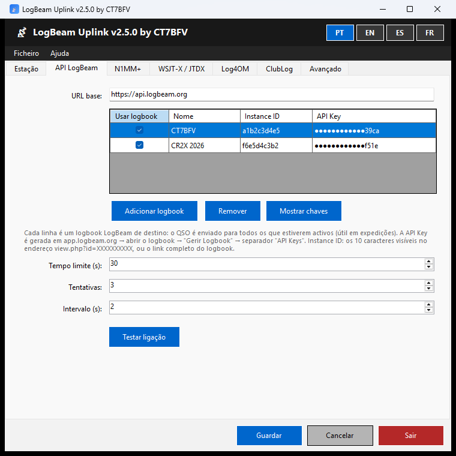
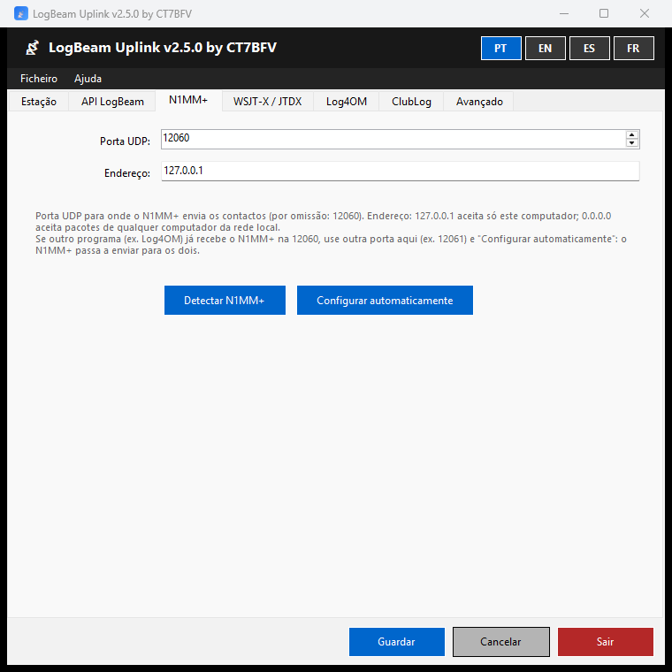
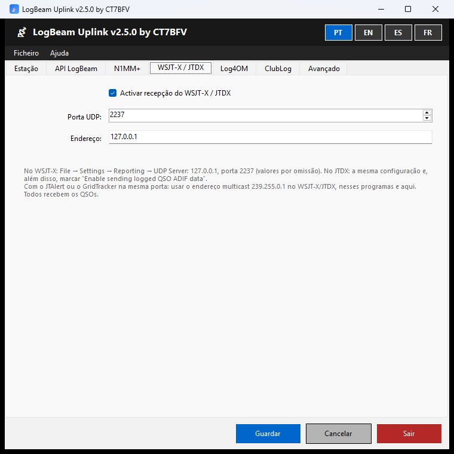
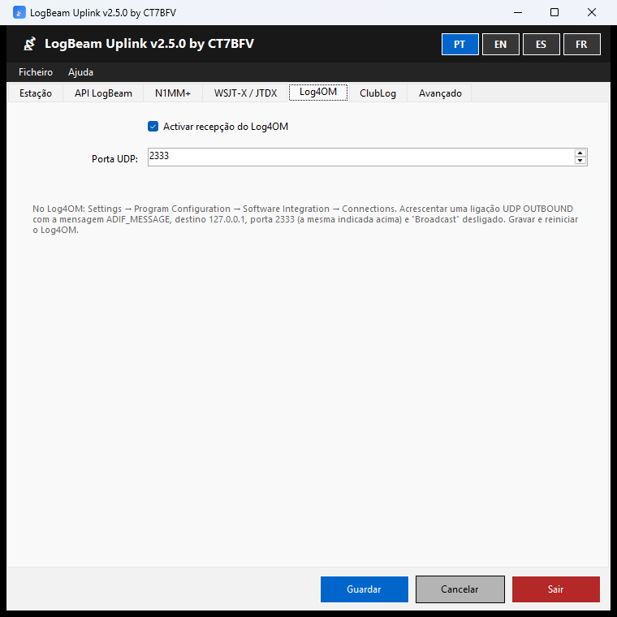
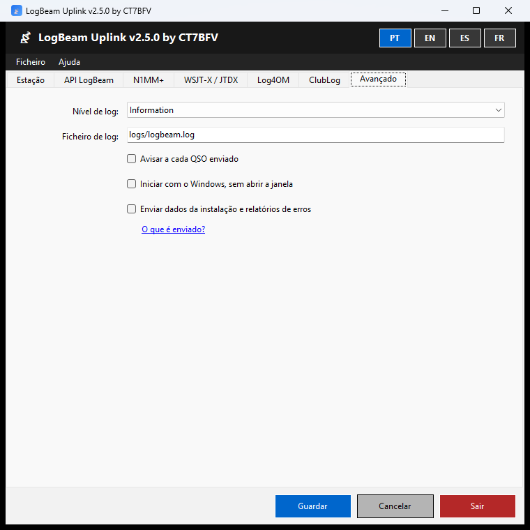
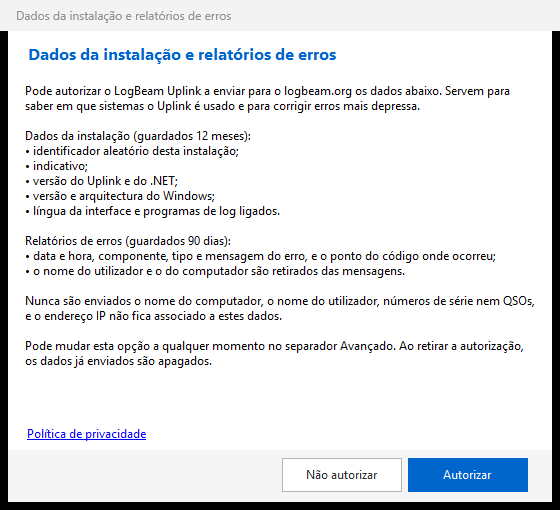

<p align="center"></p>

<h1 align="center">LogBeam Uplink</h1>

<p align="center"><b>Cada QSO do N1MM+, do WSJT-X, do JTDX e do Log4OM no logbook LogBeam, no momento em que é registado.</b></p>

<p align="center">
  <a href="https://logbeam.org/uplink/"></a>
  
  <a href="https://www.gnu.org/licenses/gpl-3.0.html"></a>
</p>

<p align="center"><b>Português</b> · <a href="README.en.md">English</a> · <a href="README.es.md">Español</a> · <a href="README.fr.md">Français</a></p>

---

O LogBeam Uplink é uma aplicação para Windows que fica na área de notificação, junto ao relógio. Recebe cada QSO no momento em que é registado no programa de log e envia-o para o logbook do operador no [LogBeam](https://logbeam.org) e, se o activar, para o ClubLog. O globo 3D do LogBeam actualiza-se sozinho, sem exportar nem importar ficheiros ADIF.

<p align="center"><a href="https://logbeam.org"></a></p>

**Índice:** [Funcionalidades](#funcionalidades) · [Capturas de ecrã](#capturas-de-ecrã) · [Descarregar e instalar](#descarregar-e-instalar) · [Começar](#começar) · [Manual](#manual) · [Limitações](#limitações-da-versão-250) · [Privacidade](#privacidade) · [Compilar](#compilar) · [Contribuir](#contribuir-e-segurança) · [Licença](#licença)

## Funcionalidades

### Programas de log

| Programa | Como liga ao Uplink | Manual |
|---|---|---|
| **N1MM+** | Configuração automática com um clique. É feita uma cópia de segurança da configuração do N1MM+ e os destinos que já lá estavam mantêm-se | [N1MM+](docs/MANUAL.pt.md#n1mm) |
| **WSJT-X** e **JTDX** | Pelo UDP Server do próprio programa (porta 2237). Partilha a porta com o JTAlert e o GridTracker através de multicast | [WSJT-X / JTDX](docs/MANUAL.pt.md#wsjt-x--jtdx) |
| **Log4OM** | Por uma ligação UDP OUTBOUND com a mensagem ADIF_MESSAGE (porta 2333) | [Log4OM](docs/MANUAL.pt.md#log4om) |

### Destinos

| Funcionalidade | Descrição | Manual |
|---|---|---|
| Vários logbooks LogBeam | Cada QSO é enviado para todos os logbooks activos, por exemplo o de uma expedição e o pessoal. Cada logbook liga-se e desliga-se com um clique no menu do ícone | [API LogBeam](docs/MANUAL.pt.md#api-logbeam) |
| Testar ligação | Confirma a API key e mostra de quem é o logbook | [API LogBeam](docs/MANUAL.pt.md#api-logbeam) |
| ClubLog em tempo real | Envio com uma Application Password do ClubLog. Se o ClubLog recusar as credenciais, o envio pára até serem corrigidas, para o IP não ser bloqueado | [ClubLog](docs/MANUAL.pt.md#clublog) |

### Fiabilidade

| Funcionalidade | Descrição | Manual |
|---|---|---|
| Fila sem internet | Os QSOs que não puderem ser enviados ficam numa fila, que sobrevive a reinícios do Uplink e do Windows. Nova tentativa a cada minuto, pela ordem de chegada | [Sem internet](docs/MANUAL.pt.md#5-sem-internet) |
| Duplicados | O servidor detecta os QSOs repetidos ao minuto e o Uplink avisa que o QSO já existia | [Avisos](docs/MANUAL.pt.md#3-a-janela-e-a-área-de-notificação) |
| Porta ocupada | Aviso quando outro programa ocupa a porta de um programa de log | [Resolução de problemas](docs/MANUAL.pt.md#8-resolução-de-problemas) |
| Exportar a sessão | Grava num ficheiro ADIF os QSOs enviados desde que o serviço arrancou | [Exportar a sessão](docs/MANUAL.pt.md#6-exportar-a-sessão) |
| Logs diários | Um ficheiro de log por dia, guardado 30 dias, com nível de detalhe ajustável | [Avançado](docs/MANUAL.pt.md#avançado) |

### No dia-a-dia

| Funcionalidade | Descrição | Manual |
|---|---|---|
| Área de notificação | Fechar a janela não termina o programa. O menu do ícone liga e desliga o serviço e cada logbook | [A janela e a área de notificação](docs/MANUAL.pt.md#3-a-janela-e-a-área-de-notificação) |
| Avisos | Falhas de envio, QSOs enviados (opcional), duplicados e portas ocupadas | [A janela e a área de notificação](docs/MANUAL.pt.md#3-a-janela-e-a-área-de-notificação) |
| ✓ Confirmado por outro LogBeam | Aviso quando o correspondente também tem o QSO num logbook LogBeam | [A janela e a área de notificação](docs/MANUAL.pt.md#3-a-janela-e-a-área-de-notificação) |
| Iniciar com o Windows | O Uplink arranca com o Windows, sem abrir a janela | [Avançado](docs/MANUAL.pt.md#avançado) |
| Uma só instância | Abrir o Uplink outra vez traz para a frente a janela que já está aberta | [A janela e a área de notificação](docs/MANUAL.pt.md#3-a-janela-e-a-área-de-notificação) |
| Actualizações | O Uplink verifica no arranque se há uma versão nova e avisa | [Actualizações](docs/MANUAL.pt.md#7-actualizações) |
| Quatro línguas | Interface em português, inglês, espanhol e francês, escolhida nos botões do topo da janela | [A janela e a área de notificação](docs/MANUAL.pt.md#3-a-janela-e-a-área-de-notificação) |

### Segurança e privacidade

| Funcionalidade | Descrição | Manual |
|---|---|---|
| Chaves cifradas | As API keys e as passwords ficam cifradas pelo Windows, só legíveis pelo utilizador que as gravou. Na grelha aparecem mascaradas | [Resolução de problemas](docs/MANUAL.pt.md#8-resolução-de-problemas) |
| Só este computador | Por omissão, o Uplink só aceita pacotes deste computador. Receber da rede local tem de ser pedido | [N1MM+](docs/MANUAL.pt.md#n1mm) |
| Dados só com autorização | Os dados da instalação e os relatórios de erros só são enviados com autorização, e são apagados do servidor quando ela é retirada | [Primeiro arranque](docs/MANUAL.pt.md#2-primeiro-arranque) |
| Instalação simples | Sem privilégios de administrador e sem instalar o .NET | [Instalar](docs/MANUAL.pt.md#1-instalar) |

## Capturas de ecrã

<table>
  <tr>
    <td align="center"><a href="docs/images/pt-api.png"></a><br><sub>Logbooks de destino</sub></td>
    <td align="center"><a href="docs/images/pt-n1mm.png"></a><br><sub>N1MM+</sub></td>
  </tr>
  <tr>
    <td align="center"><a href="docs/images/pt-wsjtx.png"></a><br><sub>WSJT-X / JTDX</sub></td>
    <td align="center"><a href="docs/images/pt-log4om.png"></a><br><sub>Log4OM</sub></td>
  </tr>
  <tr>
    <td align="center"><a href="docs/images/pt-avancado.png"></a><br><sub>Avançado</sub></td>
    <td align="center"><a href="docs/images/pt-consentimento.png"></a><br><sub>Pedido de autorização no primeiro arranque</sub></td>
  </tr>
</table>

## Descarregar e instalar

A versão oficial está em **https://logbeam.org/uplink/**, com a impressão digital SHA-256 do instalador.

- **Requisitos:** Windows 10 ou 11, 64 bits.
- **Instalação:** sem privilégios de administrador e sem precisar do .NET.
- **Confirmar o instalador:** no PowerShell, `Get-FileHash .\LogBeamUplink-Setup-X.Y.Z.exe`. O resultado tem de ser igual ao SHA-256 publicado na página.

> ⚠️ O programa é gratuito e de código aberto, e é distribuído **sem assinatura digital**:
> - **SmartScreen:** o Windows pode mostrar «O Windows protegeu o seu PC». Para continuar: «Mais informações» → «Executar mesmo assim».
> - **Controlo Inteligente de Aplicações (Windows 11):** pode bloquear o instalador sem opção de continuar. Nesse caso é preciso desligá-lo em Segurança do Windows → Controlo de aplicações e do browser → Controlo Inteligente de Aplicações.

## Começar

1. No [LogBeam](https://app.logbeam.org), abrir o logbook → "Gerir Logbook" → separador "API Keys" e gerar uma chave.
2. No Uplink, separador **API LogBeam** → "Adicionar logbook": colar o link do logbook (ou o Instance ID) e a API key → "Testar ligação" → "Guardar".
3. Ligar o programa de log ao Uplink:
   - **N1MM+:** separador N1MM+ → "Configurar automaticamente", com o N1MM+ fechado.
   - **WSJT-X / JTDX:** File → Settings → Reporting → UDP Server 127.0.0.1, porta 2237. No JTDX, marcar também "Enable sending logged QSO ADIF data".
   - **Log4OM:** ligação UDP OUTBOUND com a mensagem ADIF_MESSAGE, destino 127.0.0.1, porta 2333 e "Broadcast" desligado.

> 💡 Com o JTAlert ou o GridTracker a usar a porta do WSJT-X, ver a [partilha da porta por multicast](docs/MANUAL.pt.md#wsjt-x--jtdx).

## Manual

O manual explica cada separador, os avisos, a fila sem internet e a resolução de problemas.

| Língua | Manual |
|---|---|
| Português | [docs/MANUAL.pt.md](docs/MANUAL.pt.md) |
| English | [docs/MANUAL.en.md](docs/MANUAL.en.md) |
| Español | [docs/MANUAL.es.md](docs/MANUAL.es.md) |
| Français | [docs/MANUAL.fr.md](docs/MANUAL.fr.md) |

## Limitações da versão 2.5.0

- Um QSO editado ou apagado no programa de log depois de enviado continua no LogBeam e no ClubLog tal como foi enviado. A propagação de edições e eliminações está prevista para a versão 2.6.
- Só para Windows.

## Privacidade

Os dados da instalação e os relatórios de erros só são enviados com autorização do operador, pedida no primeiro arranque e alterável no separador "Avançado". Nunca são enviados QSOs, o nome do computador nem o nome do utilizador. Ver a [política de privacidade](https://logbeam.org/#privacy).

## Compilar

<details>
<summary>Instruções para compilar o Uplink e o instalador</summary>

<br>

Requisitos: Windows 10 ou superior e o [.NET 8 SDK](https://dotnet.microsoft.com/download/dotnet/8.0) (x64).

```
dotnet build LogBeam.sln -c Release
dotnet test LogBeam.sln -c Release
```

Instalador ([Inno Setup 6](https://jrsoftware.org/isinfo.php)): publicar primeiro o executável e depois compilar o `LogBeam.iss`, que lê a versão do executável publicado:

```
dotnet publish src/LogBeam.UI/LogBeam.UI.csproj -c Release -r win-x64 --self-contained true -p:PublishSingleFile=true -p:IncludeNativeLibrariesForSelfExtract=true -o publish
ISCC.exe LogBeam.iss
```

A versão está num único sítio, o `Directory.Build.props`. As versões oficiais são compiladas pelo `.github/workflows/release.yml` ao criar uma etiqueta `vX.Y.Z`.

**ClubLog:** o envio para o ClubLog precisa de uma chave de aplicação do ClubLog, que não está no repositório. Sem ela, a aplicação compila e funciona, mas o envio para o ClubLog fica desactivado. Para a incluir numa compilação própria, definir a variável de ambiente `CLUBLOG_API_KEY` ou criar o ficheiro `clublog.key` na raiz do repositório (não versionado). A chave é pedida ao ClubLog por quem distribui a aplicação.

</details>

## Contribuir e segurança

- Contribuições: ver [CONTRIBUTING.md](CONTRIBUTING.md).
- Falhas de segurança: comunicar em privado, como indicado em [SECURITY.md](SECURITY.md).

## Licença

O LogBeam Uplink é software livre, distribuído com a [GNU General Public License v3.0](https://www.gnu.org/licenses/gpl-3.0.html). O texto completo está no ficheiro [LICENSE](LICENSE).

## Aviso

- O software é distribuído sem garantia de qualquer tipo.
- As versões alteradas são da responsabilidade de quem as altera e distribui; o autor não responde por elas.
- As versões oficiais são apenas as publicadas em https://logbeam.org/uplink/, com o SHA-256 indicado na página.
- O nome LogBeam e o ícone identificam a versão oficial; as versões alteradas devem usar outro nome (GPL v3, secção 7, alínea e).

---

<p align="center">© 2026 Octávio Filipe Pereira Gonçalves (CT7BFV) · <a href="https://logbeam.org">logbeam.org</a></p>
