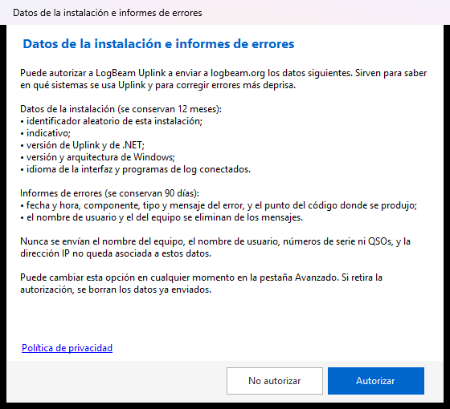
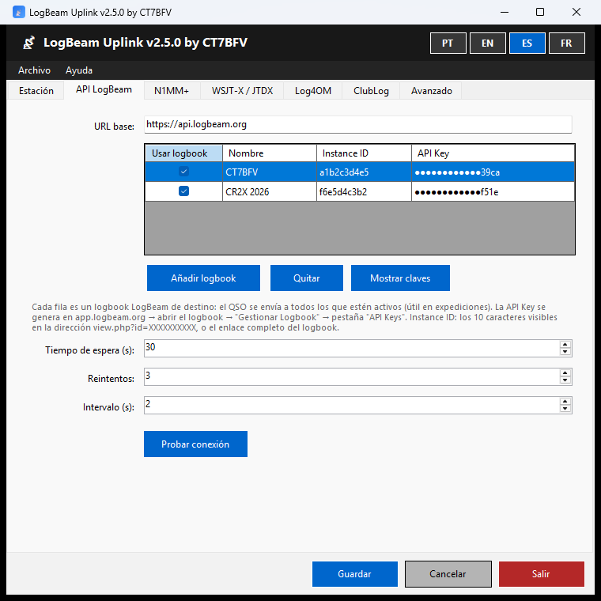
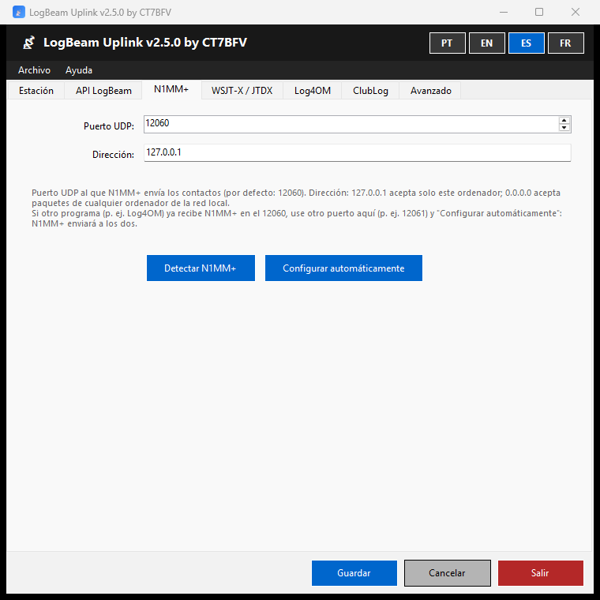
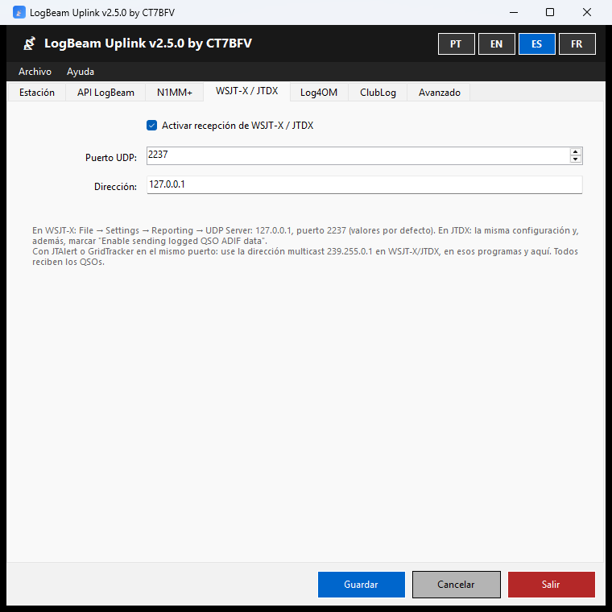
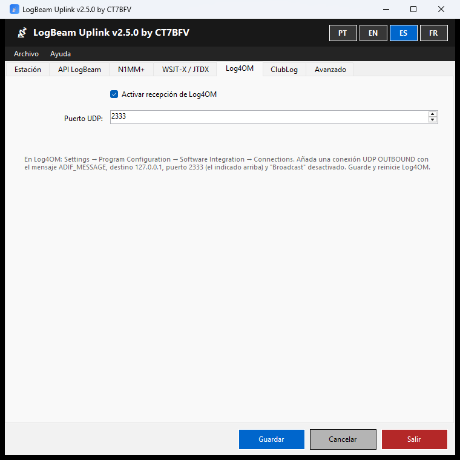
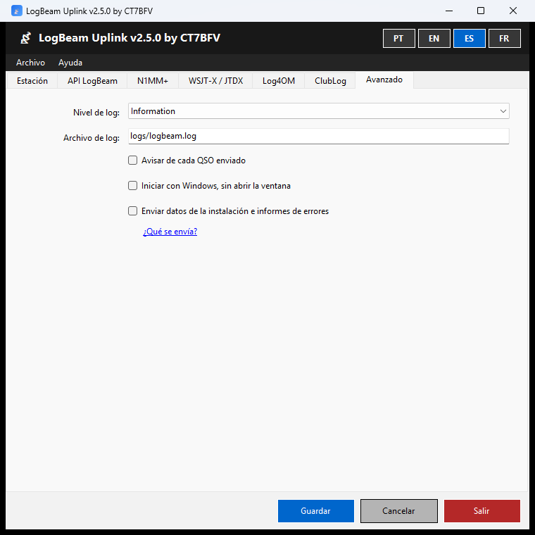

<h1 align="center">Manual de LogBeam Uplink 2.5</h1>

<a href="MANUAL.pt.md">Português</a> · <a href="MANUAL.en.md">English</a> · <b>Español</b> · <a href="MANUAL.fr.md">Français</a>

LogBeam Uplink es una aplicación para Windows que recibe los QSOs de **N1MM+**, **WSJT-X**, **JTDX** y **Log4OM** en el momento en que se registran y los envía a uno o varios logbooks de [LogBeam](https://logbeam.org) y, si lo activa, a **ClubLog**.

**Índice:** [1. Instalar](#1-instalar) · [2. Primer arranque](#2-primer-arranque) · [3. La ventana y el área de notificación](#3-la-ventana-y-el-área-de-notificación) · [4. Pestañas](#4-pestañas) · [5. Sin internet](#5-sin-internet) · [6. Exportar la sesión](#6-exportar-la-sesión) · [7. Actualizaciones](#7-actualizaciones) · [8. Solución de problemas](#8-solución-de-problemas) · [9. Desinstalar](#9-desinstalar)

## 1. Instalar

1. Descargue el instalador en **https://logbeam.org/uplink/** y compruebe la huella digital SHA-256 publicada en la página. En PowerShell, en la carpeta del archivo: `Get-FileHash .\LogBeamUplink-Setup-2.5.0.exe`.
2. Ejecute el instalador. No necesita privilegios de administrador ni .NET: se instala en `%LOCALAPPDATA%\Programs\LogBeam Uplink` y crea un acceso directo en el menú Inicio.

> ⚠️ El programa es gratuito y de código abierto, y se distribuye **sin firma digital**. Por eso:
> - **SmartScreen:** si aparece «Windows protegió su PC», pulse «Más información» → «Ejecutar de todas formas».
> - **Control inteligente de aplicaciones (Windows 11):** puede bloquear el instalador sin opción de continuar. En ese caso hay que desactivarlo en Seguridad de Windows → Control de aplicaciones y navegador → Control inteligente de aplicaciones.

## 2. Primer arranque

La primera vez, Uplink pregunta si puede enviar a LogBeam los **datos de la instalación** y los **informes de errores**. La ventana enumera exactamente lo que se envía; no se envía nada sin pulsar «Autorizar». Puede cambiar la elección en cualquier momento en la pestaña **Avanzado**. Si retira la autorización, los datos ya enviados se borran del servidor.

## 3. La ventana y el área de notificación

- Cerrar la ventana con la **X** no cierra el programa: Uplink sigue funcionando, con su icono en el área de notificación. Para salir, use el botón **Salir** o el menú del icono.
- Un doble clic en el icono de Uplink, en el área de notificación, abre la ventana.
- Uplink solo se abre una vez: si lo abre de nuevo, la ventana que ya estaba abierta pasa al frente.
- Los botones **PT · EN · ES · FR**, en la parte superior de la ventana, cambian el idioma.

**Menú del icono** (botón derecho sobre el icono de Uplink):

| Opción | Para qué |
|---|---|
| Abrir | Muestra la ventana |
| Enviar a | Activa o desactiva cada logbook con un clic (p. ej., para pasar al logbook de un concurso). El cambio se guarda al momento |
| Iniciar servicio · Detener servicio | Activa o desactiva la recepción y el envío de QSOs |
| Salir | Cierra el programa |

**Avisos (junto al reloj):**

| Aviso | Cuándo |
|---|---|
| Error al enviar el QSO | Siempre |
| QSO enviado | Solo con «Avisar de cada QSO enviado» (pestaña Avanzado) |
| El QSO ya existía en el logbook | El QSO ya estaba allí (el servidor detecta duplicados al minuto). Solo con la misma opción |
| ✓ Confirmado por otro LogBeam | El corresponsal también tiene el QSO en un logbook de LogBeam |
| Puerto ocupado | No se puede recibir de un programa de log porque otro programa ocupa el puerto (ver la [sección 8](#8-solución-de-problemas)) |

## 4. Pestañas

Después de cambiar cualquier cosa, pulse **Guardar**: el servicio se reinicia con la nueva configuración. **Cancelar** restablece lo que estaba guardado.

### Estación

**Indicativo:** se usa en el envío a ClubLog, salvo que se indique otro en la pestaña ClubLog. La ubicación de los corresponsales la gestiona el servidor de LogBeam.

### API LogBeam

Cada fila de la tabla es un logbook de LogBeam de destino. El QSO se envía a todos los que tengan marcado **Usar logbook** (por ejemplo, el logbook de una expedición y el personal).

1. **Añadir logbook**.
2. **Nombre:** libre, para reconocer el logbook en el menú del icono.
3. **Instance ID:** los 10 caracteres de la dirección `view.php?id=XXXXXXXXXX`, o el enlace completo del logbook (Uplink extrae el identificador).
4. **API Key:** se genera en app.logbeam.org → abrir el logbook → «Gestionar Logbook» → pestaña «API Keys». Tiene 64 caracteres.
5. **Probar conexión:** comprueba la clave y muestra de quién es el logbook («Conexión establecida: logbook de CT7XXX.»).
6. **Guardar**.

Las claves aparecen enmascaradas en la tabla (solo los 4 últimos caracteres); **Mostrar claves** las muestra completas. Al editar la celda, la clave aparece completa.

**URL base**, **Tiempo de espera**, **Reintentos** e **Intervalo** no necesitan cambiarse.

### N1MM+

- **Configurar automáticamente:** con N1MM+ cerrado, configura N1MM+ para enviar los contactos a Uplink. Antes de modificarlo se hace una copia de seguridad del archivo de configuración de N1MM+, y los destinos que ya existían se mantienen.
- **Detectar N1MM+:** indica si N1MM+ ya está configurado.
- **Puerto UDP** (por defecto 12060) y **Dirección** (127.0.0.1 = solo este ordenador; 0.0.0.0 = cualquier ordenador de la red local).

Si otro programa (p. ej., Log4OM) ya recibe N1MM+ en el puerto 12060, use aquí otro puerto (p. ej., 12061) y pulse «Configurar automáticamente»: N1MM+ enviará a los dos.

Para configurarlo a mano, ver el menú **Ayuda → Configurar N1MM+...**

### WSJT-X / JTDX

1. Marque **Activar recepción de WSJT-X / JTDX**.
2. En WSJT-X: File → Settings → Reporting → UDP Server **127.0.0.1**, puerto **2237** (los valores por defecto).
3. En JTDX: la misma configuración y, además, marque **«Enable sending logged QSO ADIF data»**.

> 💡 **Con JTAlert o GridTracker en el mismo puerto:** dos programas no pueden recibir del mismo puerto normal. Use una dirección **multicast**, por ejemplo **239.255.0.1**, en WSJT-X/JTDX (UDP Server), en esos programas y en el campo **Dirección** de Uplink. Así todos reciben los mismos paquetes. En multicast, Uplink solo acepta paquetes de este ordenador.

### Log4OM

1. Marque **Activar recepción de Log4OM**.
2. En Log4OM: Settings → Program Configuration → Software Integration → Connections. Añada una conexión **UDP OUTBOUND** con el mensaje **ADIF_MESSAGE**, destino **127.0.0.1**, puerto **2333** y **«Broadcast» desactivado**. Guarde y reinicie Log4OM.

### ClubLog

1. Marque **Activar envío en tiempo real**.
2. **Correo de ClubLog** y **App Password**: una «Application Password» creada en ClubLog, no la contraseña de acceso al sitio.
3. **Indicativo (opcional):** en blanco usa el de la pestaña Estación; si también está en blanco, el del programa de log.

Recibe los QSOs de todos los programas (N1MM+, WSJT-X, JTDX y Log4OM) y usa la misma cola sin internet que los logbooks. Si ClubLog rechaza las credenciales, Uplink deja de enviar hasta que se corrijan y se guarden: ClubLog bloquea la IP de quien insiste con credenciales erróneas.

### Avanzado

| Opción | Para qué |
|---|---|
| Nivel de log | Cantidad de información en el archivo de log. «Information» basta para el día a día; «Debug» para investigar un problema |
| Archivo de log | Dónde se guarda el log (por defecto, la carpeta `logs` de Uplink) |
| Avisar de cada QSO enviado | Aviso también para los QSOs enviados correctamente |
| Iniciar con Windows, sin abrir la ventana | Uplink arranca con Windows, solo con su icono en el área de notificación |
| Enviar datos de la instalación e informes de errores | La autorización del primer arranque; «¿Qué se envía?» muestra la lista |

## 5. Sin internet

Si un QSO no se puede enviar (sin red, servidor no disponible), queda en una cola y Uplink vuelve a intentarlo cada minuto, por orden de llegada. La cola se conserva al reiniciar Uplink y Windows.

Los errores que no se resuelven reenviando, como una API key revocada o un logbook borrado, no quedan en la cola: aparece el aviso de error y el motivo queda en el log.

## 6. Exportar la sesión

**Archivo → Exportar sesión a ADIF...** guarda en un archivo ADIF los QSOs enviados correctamente desde que arrancó el servicio.

## 7. Actualizaciones

Uplink comprueba al arrancar si hay una versión nueva y avisa. También puede comprobarlo en **Ayuda → Buscar actualizaciones...** Las versiones nuevas están en https://logbeam.org/uplink/.

## 8. Solución de problemas

| Síntoma | Qué hacer |
|---|---|
| «Puerto ocupado» | Otro programa usa el mismo puerto. WSJT-X/JTDX: use multicast ([sección 4](#wsjt-x--jtdx)). N1MM+: use otro puerto y «Configurar automáticamente» |
| «API Key no válida» o «Instance ID no válido» al guardar | Compruebe la clave (64 caracteres) y el enlace del logbook; use «Probar conexión» |
| Los QSOs no llegan | Compruebe la configuración del programa de log ([sección 4](#4-pestañas)) y que el servicio está iniciado (menú del icono). Ponga el nivel de log en «Debug», haga un QSO y mire el archivo de log |
| Un QSO se corrigió o se borró en el programa de log | En la versión 2.5.0, las ediciones y los borrados no llegan a LogBeam ni a ClubLog. Está previsto para la 2.6 |
| Windows bloquea el instalador o el programa | Ver los avisos sobre SmartScreen y el Control inteligente de aplicaciones ([sección 1](#1-instalar)) |

**Archivos**, en la carpeta de instalación (`%LOCALAPPDATA%\Programs\LogBeam Uplink`):

| Archivo | Contenido |
|---|---|
| `settings.json` | Configuración. Las API keys y las contraseñas se guardan cifradas, legibles solo por el usuario de Windows que las guardó |
| `queue.json` | QSOs pendientes de envío |
| `logs\` | Un archivo de log por día, conservados 30 días |
| `telemetry.json` | Informes de errores pendientes de envío (solo con autorización) |

## 9. Desinstalar

Configuración de Windows → Aplicaciones → LogBeam Uplink → Desinstalar. El desinstalador borra el programa, los logs y el inicio con Windows. La configuración (`settings.json`) y la cola (`queue.json`) se quedan en la carpeta para que una reinstalación las aproveche; para eliminarlas, borre la carpeta `%LOCALAPPDATA%\Programs\LogBeam Uplink`.

---

© 2026 Octávio Filipe Pereira Gonçalves (CT7BFV) · [GNU General Public License v3.0](https://www.gnu.org/licenses/gpl-3.0.html)
